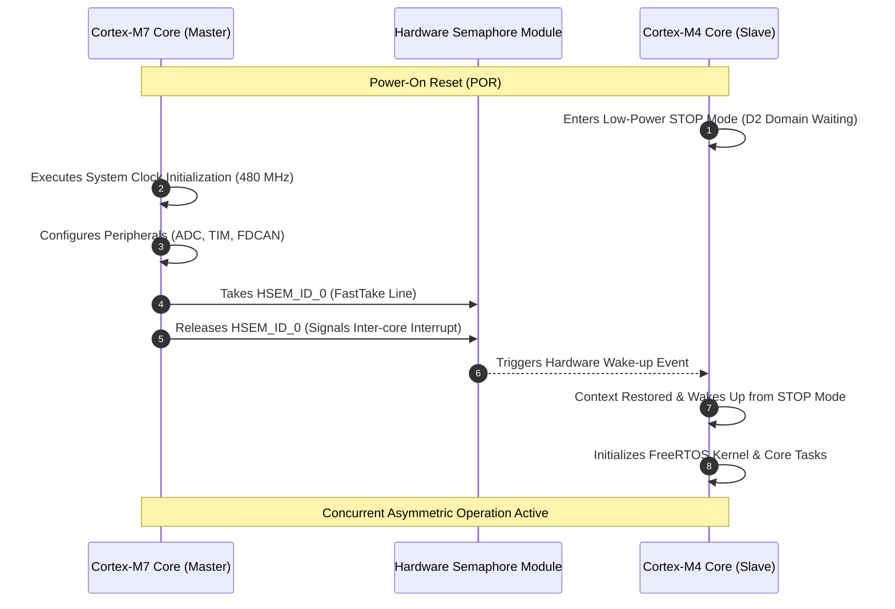

# Dual-Core Smart Air Pressure Control System (John Deere Challenge)

-blue?style=flat-square&logo=stmicroelectronics)

An industrial-grade multi-core embedded platform designed in collaboration with **John Deere** to resolve dynamic tire inflation requirements across varying agricultural terrains (urban, mud, paved, and field environments). Powered by an **STM32H745ZIT3** micro-controller, the system implements an **Asymmetric Multiprocessing (AMP)** model to segregate deterministic real-time control laws from high-abstraction application workflows.

## 📊 Project Metadata
* **Timeline:** 5th Semester - Advanced Embedded Systems Design Class (December 2022)
* **Corporate Partner:** John Deere
* **Target Hardware:** Dual-Core ARM Cortex-M7 (480 MHz) & Cortex-M4 (240 MHz)
* **Engineering Focus:** Asymmetric Processing Cores, Hardware Synchronization, Next-Gen Automotive Networks (FDCAN), Closed-Loop Industrial Control.

---

## 🛠️ Asymmetric Multiprocessing (AMP) Core Architecture

The system utilizes both processing domains through a strictly isolated hardware peripheral split configured in STM32CubeMX:

### 🎯 Cortex-M7 Core (Master Real-Time Execution Core)
Operating at 480 MHz, the CM7 acts as the deterministic control master. It orchestrates hardware initialization and manages critical physical boundaries:
* **High-Resolution Data Acquisition:** Configured an asynchronous 16-bit ADC1 on channel 5 to poll an analog industrial pressure transducer (`SensorPress`) with 65,535 quantization steps.
* **Actuation Drivers:** Direct control over two hardware timers (`TIM2` and `TIM4`) driving 16-bit resolution PWM lines to modulate a heavy-duty air compressor and an overpressure electro-solenoid valve.
* **Automotive Networking Subsystem:** Direct ownership of the **FDCAN1** hardware peripheral. Operating in Classic CAN mode with a nominal bitrate configured at 500 Kbps, using hardware masking filters (`FilterID1: 0x321`) to receive target setpoint parameters asynchronously from the tractor central bus.

### ⚙️ Cortex-M4 Core (Supervisor & Operating System Core)
Operating at 240 MHz, the CM4 handles computing-heavy or human-machine interface tasks:
* **Task Scheduling:** Runs a FreeRTOS kernel (`FREERTOS_M4`) managing synchronization for non-real-time operations.
* **Storage Systems:** Owns a FAT File System stack (`FATFS_M4`) integrated with an SD card interface for operational blackbox parameter data-logging.
* **Connectivity Layers:** Runs a native USB Device controller (`USB_DEVICE_M4`) for external system diagnostics.

---

## 🔄 Boot Sequence & Hardware Inter-Core Synchronization

To prevent race conditions, memory collisions, or illegal peripheral access during boot, the dual-core domain architecture implements a strict hardware-handshake protocol using **Hardware Semaphores (HSEM)**:

## 📐 Control Law Implementation & Vehicle Network Integration

The CM7 core executes a continuous discrete Feedback Control Loop:

* **Sensor Processing:** The 16-bit analog representation is normalized to a voltage scale (0.0V - 3.3V) and mapped linearly to physical pressure units through a specialized transducer formula ($PSI = \frac{V_{out} - 0.5}{4} \times 150$).
* **PID Computation:** A custom positional PID tracking function updates every 500ms, mapping calculation metrics into compressor duty cycle thresholds bounded between $0$ and $65,535$ internal counter steps.
* **Safety Interlocks:** Active firmware layers supervise overpressure conditions. If live sensor variables cross the threshold boundary of $110\%$ of the active target setpoint, a high-priority hardware override fully saturates `TIM4->CCR1` to purge pressure instantly.

---

## 🔍 Engineering Retrospective & Future Work (Post-Years Evaluation)

Reviewing this firmware from a post-graduate standpoint highlights critical design bugs and micro-architectural constraints. While **the original code remains entirely unaltered** to serve as an authentic academic baseline, a production-grade refactoring would address the following flaws:

### 1. Compilation Failures & Variable Shadowing Conflicts
* **The Bug:** Global descriptors contain a severe type conflict re-declaring `setPoint` as an `int` and subsequently as a `double` within a 3-line span. This breaks compiler tokenization routines immediately.
* **The Refactor:** Eliminate global type redundancy by enforcing strict structural encapsulation (`struct SystemState`) to separate target points from variable variables under safe naming architectures.

### 2. Case-Sensitivity Typo Resulting in an Open-Loop Bug
* **The Bug:** Sensor capture registers write data directly into the lowercase `pressure` variable, but the `PID_Compute` macro is initialized passing the address of an unrelated, un-updated global labeled `Pressure` (Capital P). The PID controller is effectively blind, calculating feedback adjustments on an unchanging memory offset.
* **The Refactor:** Rectify the typo to restore closed-loop functionality and configure the compiler toolchain warning flags to absolute strictness (`-Werror -Wuninitialized`) to completely block builds containing unmapped global state deviations.

### 3. Static Network Telemetry Streams
* **The Bug:** `HAL_FDCAN_AddMessageToTxFifoQ` dispatches the static array `TxData`, which is never dynamically written with live operational variables inside the main processing cycle, broadcasting empty data frames onto the bus.
* **The Refactor:** Pack data frames efficiently before calling the transmission hardware buffers, scaling variables into high-density byte arrays using professional standard bit-shifting constraints: `TxData[0] = (uint8_t)((uint16_t)pressure & 0xFF);`.

### 4. CPU Domination & Unbounded Execution Cycles
* **The Bug:** The main `while(1)` block has its delay cycles entirely commented out. The Cortex-M7 runs completely unthrottled at 480 MHz, causing immense bus congestion and wasting power resources.
* **The Refactor:** Migrate the control flow to a strict **Hardware-Timer-Triggered Interrupt (ISR)** or setup a FreeRTOS thread model to put the processor core into an explicit block state between execution ticks, dropping active current draws significantly.
